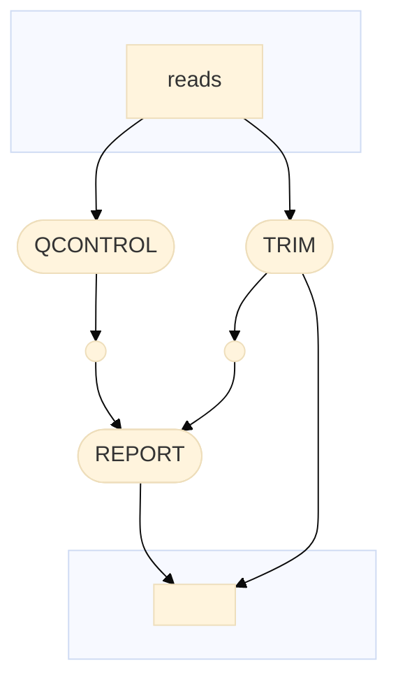

# qcontrol_nf
Nextflow-based pipeline for quality control



## Description

The pipeline is implemented in Nextflow and includes several stages for NGS data analysis:

1. **QCONTROL:** Quality control using FastQC.
2. **TRIM:** Data preprocessing using Fastp.
3. **REPORT:** Compiling report using MultiQC.

## Usage

### Quick Start

To quickly run the pipeline, use the following command:

```bash
nextflow run glebus-sasha/octopus_nf \
-profile <docker/singularity> \
--reference <path-to-reference> \
--reads "<path-to-reads-folder>/*[rR]{1,2}*.fastq*" \ # quotes are important
--outdir results
```

### Requirements

- Nextflow (https://www.nextflow.io/docs/latest/install.html)
- Docker (https://docs.docker.com/engine/install/) or
- Singularity (https://github.com/sylabs/singularity/blob/main/INSTALL.md)

### Running the Pipeline

1. Install all the necessary dependencies such as Nextflow, Singularity.
3. Clone this repository: `git clone https://github.com/glebus-sasha/octopus.git`
4. Navigate to the pipeline directory: `cd octopus_nf`
5. Edit the `nextflow.config` file to set the required parameters, if necessary.
6. Run the pipeline, setting the required parameters, for example:

```bash
nextflow run main.nf
```

## License

This project is licensed under the [MIT License](LICENSE).
